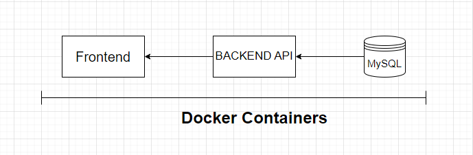

# Web-project-real-estate-sales-company
Full stack web project for a fictional real estate sales company. Technologies : ReactJS, Bootstrap, NodeJS, MySql, Docker.


## Description

In this project, I made a realistic web project for a fictional real estate sales company.
The goal was to present the company and list dynamically their actual sales.

## Architecture

To achieve this goal, I used an architecture with : a dynamic frontend / an API as backend / a database, all launched in docker containers.

## Technologies

Frontend : React JS and Bootstrap
Backend API : Nodejs/Express API
Database : MySQL
Deployment : Docker

## Test the project :

### Informations and requierements :

This repository share all the source code of the project. The Licence is MIT, so feel free to pull, modify and use the source code as you wish.

However, please verify and respect the licence of the images included in the project. They are not mine, but free to use for personals projects.

### Test with docker images

#### Step 1 :

If your goal is to test the project, you can only download the "docker-compose.yml" file.

#### Step 2 :

Docker is requiered in your system.

In the terminal, go in the folder where the docker-compose file is located, then type :

```
docker-compose up -d
```

#### Step 3 :

When the project and the containers are launched for the first time, please restart manually the node_api container once. This is the only time this action is required.

#### Step 4 :

A mysql client is required (either MySqlWorkbench or the client inside the mysql container itself).

You can insert data in the database, which will be then fetched by the api and displayed in the website. Here an example of sql script :

```
USE housesdb;

INSERT INTO regions VALUES ("Bretagne");

INSERT INTO departments VALUES ("Morbihan","Bretagne");

INSERT INTO cities VALUES ("Vannes","Morbihan");

INSERT INTO houses (address,city,price,department,region,surface)
VALUES ("10 rue X", "Lorient", "1 000 000", "Morbihan", "Bretagne", 550);
```
